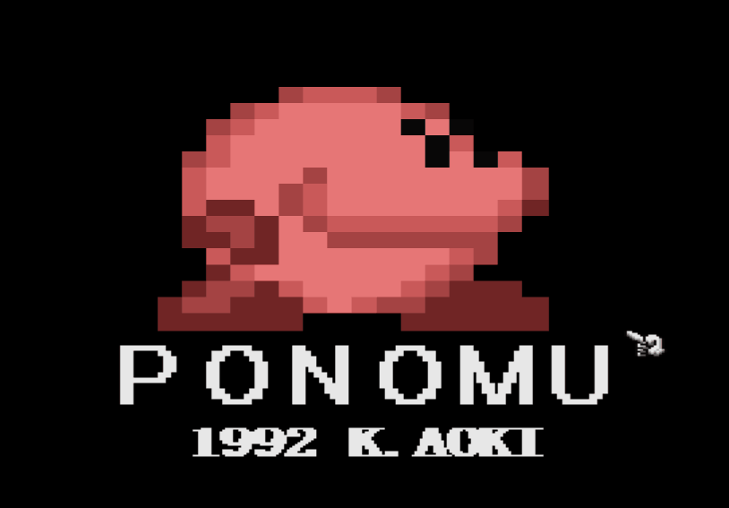

# PONOMU
ひたすら歩き続ける「ぽのむ」をゴールに導くゲームです。



高校生の時に開発して、マイコンBASIC Magazine 1992年10月号 に掲載されました。

https://www.google.com/search?q=%E3%83%99%E3%83%BC%E3%82%B7%E3%83%83%E3%82%AF%E3%83%9E%E3%82%AC%E3%82%B8%E3%83%B3+PONOMU

## 動かし方
X68000 の X-BASIC で動作しますので、basicを立ち上げた後に、以下のコマンドで実行してください。

```
load "PONOMU.BAS"
run
```

## 1992年のコードとの差異
高校名と名前が書かれていたのでコピーライト表記に変更しました。また、配布されている Human68k でも動くように音の処理をコメントアウトしています。

## 1992年に投稿した記事内容
X68000(X-BASIC V2.0)用
### 内容
何も考えずに歩いている"ぽのむ"（生き物）を、上手に扉まで連れて行ってください。
### 遊びかた
まずプログラムを打ち終えてから"RUN"すると、キャラクターをディスクに制作しはじめます。終わったらタイトル画面が映るので、マウスの左ボタンを押してください。すべてマウスで操作します。
マウスの左ボタンでブロックを取り、右ボタンでブロックを置きます。取ることのできるブロックは赤色のブロックです。しかし、一回とっておくと青色のブロックに変わり、ブロックを取ることができなくなります。ブロックの持てる数は１個までです。  
"ぽのむ"の周囲の地形をうまく変化させて扉に入れれば、そのステージをクリアします。扉は、画面上にある鍵をすべて取ると開きます。  
"ぽのむ"が動けない状態になったらマウスの両方のボタンを押すと、そのステージのはじめから再びプレイできます。  
"ぽのむ"の動きをよく理解してブロックを動かしてください。全部で10面あります。がんばってください。  
### プログラムについて
すべてBASICです。プログラムを見てわかるように、ほんの少ししかメインとなるプログラムがありません。データのプログラムが長くなってしまいました。

<第１表> 変数表
|  変数  |  説明  |
| ---- | ---- |
|  ml  |  マウスの左ボタンの状態  |
|  mr  |  マウスの右ボタンの状態  |
|  mx  |  マウスのX座標  |
|  my  |  マウスのY座標  |
|  st  |  今のステージ数  |
|  px  |  ぽのむのX座標１  |
|  py  |  ぽのむのY座標１  |
|  pk  |  今の鍵の状態  |
|  ix  |  ぽのむのスピード  |
|  pix  |  ぽのむのX座標２  |
|  piy  |  ぽのむのY座標２  |
|  si  |  死んでいるか？  |
|  pp  |  ぽのむの形  |
|  pka  |  ぽのむの形  |
|  tem  |  ぽのむが歩く形  |
|  h1～h4  |  判定  |

